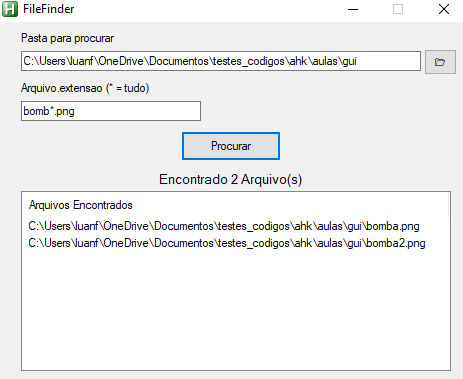

# Buscador de Arquivos em Diretórios e SubDiretorios no Computador (Windows)
## Autor: Luan Fellipe (allen08)
### Plataforma (Linguagem): AutoHotKey

### [*] Uso:

    1. Execute o arquivo FileFinder.exe ou FileFinder.ahk se você tiver o AutoHotKey devidamente instalado no dispositivo.

    2. Arraste a pasta desejada para busca do arquivo até o programa ou clique no icon da pasta na direita e selecione a pasta desejada.
    
    3. Insira a parte do nome do arquivo e/ou extensão para procurar (Obs: O asterisco (*) significa "qualquer coisa" entre os nomes)
        - ex: arquivo.txt (Buscará exatamente pelo arquivo com nome "arquivo.txt" nos subdiretórios).
        - ex: ar*.txt (buscará tudo que comece com 'ar' e termine com '.txt', exemplo arquivo.txt, armario.txt, arduino.txt)
        - ex: *.pdf (buscará todos os .pdf dentro da pasta)
   
    4. Clique no botão procurar e espere que o resultado da busca.
    
    5. Se algo for encontrado, clique duas vezes com botão esquerdo para 
    abrir a pasta desejada ou clique com o botão direito para copiar o caminho do arquivo encontrado. 

    OBS: Se a pasta selecionada tiver muitos arquivos e subpastas, poderá demorar um pouco a busca.
### [*] Execução:

